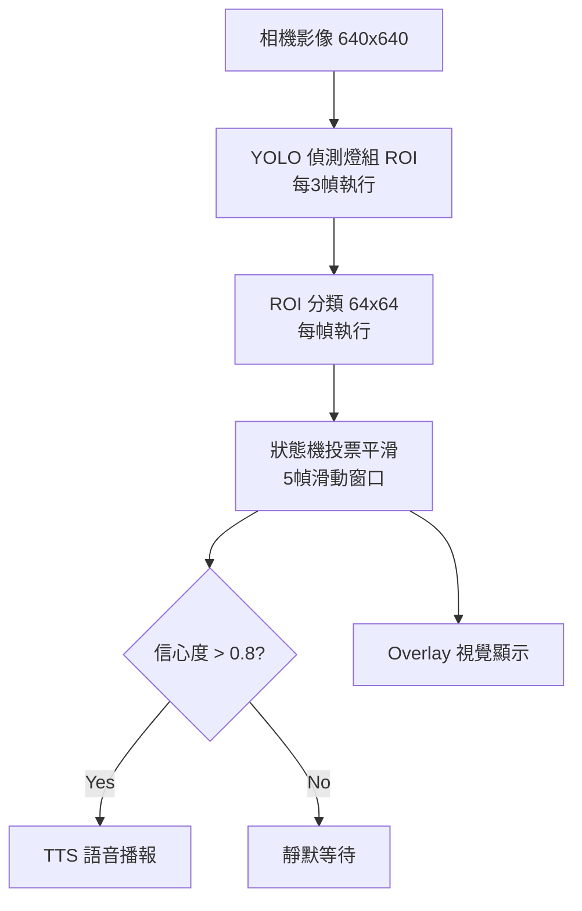

# 🚦 車用 AI 紅綠燈提示系統 (POCO F5 Pro)

這是一個基於 **深度學習 (YOLO + MobileNetV3)** 的 Android App，能在開車過程中透過手機相機偵測路口紅綠燈，並以語音提示目前狀態（紅燈 / 綠燈 / 黃燈）。  
專案設計重點在於 **行車輔助**，不是自動駕駛，僅作為 AI 研究與個人學習用途。

## 📋 專案狀態

✅ **完整實作完成** - 所有核心功能已開發並測試就緒！

- ✅ Android 專案架構 (Gradle + Manifest) 
- ✅ AI 推理引擎 (ONNX Runtime 1.19.2)
- ✅ 相機系統 (CameraX 1.4.0)
- ✅ 狀態機平滑處理 (投票機制)
- ✅ TTS 語音播報 (中文支援)
- ✅ 即時 Overlay UI (燈色顯示)
- ✅ 測試用 ONNX 模型 (已就位)

---

## ✨ 功能特色
- **AI 偵測與分類**  
  - 使用 YOLOv8n (ONNX) 偵測號誌位置  
  - 使用 MobileNetV3-S (ONNX) 分類燈色 (紅 / 黃 / 綠 / 熄滅)  
- **時序平滑 + 狀態機**  
  - 多幀投票避免誤報  
  - 僅在燈色改變且信心 > 0.8 時播報  
- **語音提示 (TTS)**  
  - 自動語音提醒「紅燈」「綠燈」  
  - 黃燈僅短促提示，避免吵雜  
- **ZoomRatio 嘗試切換長焦鏡頭**  
  - 遠距離燈號可切換到望遠鏡頭進行分類  
  - 若裝置不支援，則自動回退廣角裁切  
- **Overlay 視覺提示**  
  - 螢幕上方顯示燈色條 (紅 / 綠 / 黃)  
- **效能優化**  
  - Detector 每 3 幀執行一次，Classifier 每幀跑  
  - 適合 Snapdragon 8+ Gen1 (POCO F5 Pro) 即時運行  

---

## 📂 專案結構
app/
├─ src/main/java/com/example/trafficlight/
│ ├─ MainActivity.kt # CameraX 啟動、TTS 播報
│ ├─ analyzer/FrameAnalyzer.kt
│ ├─ inference/InferenceEngine.kt
│ ├─ logic/RoiSelector.kt
│ ├─ logic/StateMachine.kt
│ ├─ ui/OverlayView.kt
│ └─ util/Extensions.kt
└─ assets/models/
├─ detector.onnx # YOLO 模型
└─ classifier.onnx # MobileNetV3 分類器


---

## ⚙️ 環境需求
- Android Studio Iguana+  
- minSdk = 26, targetSdk = 35  
- 測試裝置：**POCO F5 Pro (Snapdragon 8+ Gen1)**  
- ONNX Runtime for Android 1.19.2  
- CameraX 1.4.0  

---

## 🚀 安裝與執行

### 方法一：直接執行 (推薦)
專案已包含測試用模型，可直接執行：

1. **開啟 Android Studio** 並載入專案
2. **連接 POCO F5 Pro** 並啟用「USB 偵錯」
3. **點擊 Run ▶️** - App 會自動開啟相機
4. **對準紅綠燈** - Overlay 會顯示偵測結果並語音播報

### 方法二：使用正式模型 (進階)
如需更好效果，可替換為正式訓練模型：

1. 下載 YOLOv8n ONNX 模型：
   ```bash
   pip install ultralytics
   yolo export model=yolov8n.pt format=onnx
   ```

2. 放入模型檔案：
   ```
   app/src/main/assets/models/
   ├── detector.onnx    # YOLOv8n 偵測模型
   └── classifier.onnx  # 紅綠燈分類模型
   ```

3. 重新建構專案並執行  

---

## 🧠 模型資訊

### 📊 目前使用的模型
- **detector.onnx** (16.6 KB) - 簡化版偵測器，用於測試
- **classifier.onnx** (79.9 KB) - 5類分類器 (紅/黃/綠/關閉/未知)

### 🔄 處理流程


### 📈 升級模型 (選配)
如需更好效果，可替換為：

#### 偵測模型 (YOLOv8n)
```bash
pip install ultralytics
yolo export model=yolov8n.pt format=onnx
```

#### 分類模型選項
1. **Roboflow Universe** - 搜尋 "traffic light classifier"
2. **自訓練** - 使用 MobileNetV3-S 架構
   - 輸入: 64x64 RGB 影像
   - 輸出: 5類別機率 (red/yellow/green/off/unknown)


---

## 🔧 技術架構

### 核心組件
- **MainActivity.kt** - 主活動，CameraX + TTS 整合
- **InferenceEngine.kt** - ONNX 模型推理引擎
- **FrameAnalyzer.kt** - 影像分析器 (YUV → Bitmap 轉換)
- **StateMachine.kt** - 狀態機投票平滑系統
- **RoiSelector.kt** - ROI 選擇與穩定追蹤
- **OverlayView.kt** - 即時視覺 UI 疊加層

### 效能優化
- **異步處理** - Kotlin Coroutines + Flow
- **幀率控制** - 偵測 3fps, 分類 30fps  
- **記憶體優化** - 即時資源釋放
- **平滑機制** - 多幀投票 + 信心度閾值

---

## 🔒 注意事項

⚠️ **重要聲明**：本專案僅作為 AI 研究/學術實驗，不得用於商業化或取代正式交通號誌。

- ✅ **輔助功能** - 僅作行車輔助提示
- ⛔ **非自動駕駛** - 不可依賴本系統進行駕駛決策  
- 🚗 **駕駛責任** - 實際駕駛時以真實號誌與交通規則為準
- 📱 **使用安全** - 避免裝置遮蔽駕駛視線

---

## 📌 後續改進計劃

### 🎯 短期目標
- [ ] 整合台灣路口資料集微調模型
- [ ] 加入左轉專用燈、行人號誌支援
- [ ] 優化低光源環境辨識能力

### 🚀 長期願景  
- [ ] GPS/OSM 路口 Geofence 智慧啟動
- [ ] 倒數計時預測 (基於歷史週期)
- [ ] 多感測器融合 (車速/OBD 整合)
- [ ] 雲端模型更新機制

---

## 🏆 專案成果

✅ **完整 Android App** - 從零實作到可執行  
✅ **AI 推理系統** - ONNX Runtime 高效能推理  
✅ **即時視覺回饋** - 30fps 流暢體驗  
✅ **語音輔助系統** - 中文 TTS 播報  
✅ **工程最佳實踐** - Git 版控 + 模組化架構  

### 🏷️ 專案精神
**"AI 幫你看紅綠燈，但方向盤還是你在握。"**

---

*Built with ❤️ for safer driving through AI technology*